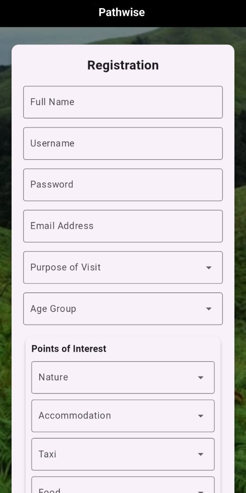
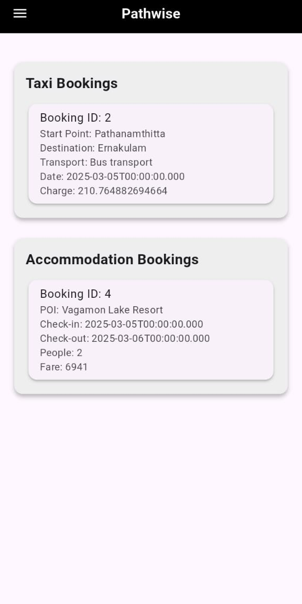

# pathwise
A city guide and navigation app for Android, based on Flutter. View recommended local points of interests (POIs) based on your preferences and make bookings for taxi and hotels all from your Android phone.

## FEATURES
- Maps Navigation.
- Integrated Hotel & Taxi Booking.
- Local POIs (Points of Interest) Recommendation.

<p float="left">
  
  
   <br>
  
  
   <br>
  
  
   <br>
</p>

## REQUIREMENTS
### Dependencies
- [Flutter](https://docs.flutter.dev/install/quick): Android Development, and for future cross-platform availability. Ensure it is correctly installed:
```
flutter doctor
```
- [Python](https://www.python.org/downloads/): Makes use of `flask` for backend integration. Install `flask` through _pip_.
```
python -m pip install flask
```

### Tools
- [VS Code](https://code.visualstudio.com/download): Code editor, but any other editor can be used as well, [with some configurations](https://docs.flutter.dev/install/manual). 
- [Android Studio](https://developer.android.com/studio): For Android SDK and optionally for using AVDs (Android Virtual Devices).
- [SQLite DB Viewer](https://sqlitebrowser.org/dl/): Optional, but any other SQLite viewer can be used as well.

## BUILD
- Clone this repository.  
```
git clone https://github.com/gautam-vox/pathwise
```
- In your code editor, navigate to the location where you cloned the repository.
- In one terminal, navigate to the _"frontend"_ directory and check for dependencies:
```
flutter pub get
```
> [!WARNING]
> Don't update any packages above required versions, that would break the dependencies.

> [!NOTE]
> Being a local application, the current IP Address must be provided manually to the script (see below). This will be changed in the near future.
- In the terminal, find your current IP address (under IPv4) by running:
```
ipconfig
```
- Open the globals file in your editor, find it at ***"...frontend/lib/globals.dart"***.
- Save your IP Address into the ipAddress global variable, within quotes.
```
ipAddress = 'YOUR_IP_ADDRESS'
```
- In a seperate terminal, navigate to the _"backend"_ directory and start the backend server:
```
python app.py
```
- In the first terminal, within the _"frontend"_ directory, build and run the app:
```
flutter run
```

## LICENSE
This repo and its contents are provided under the [GNU General Public License v2.0](https://github.com/gautam-vox/pathwise/blob/main/LICENSE)
